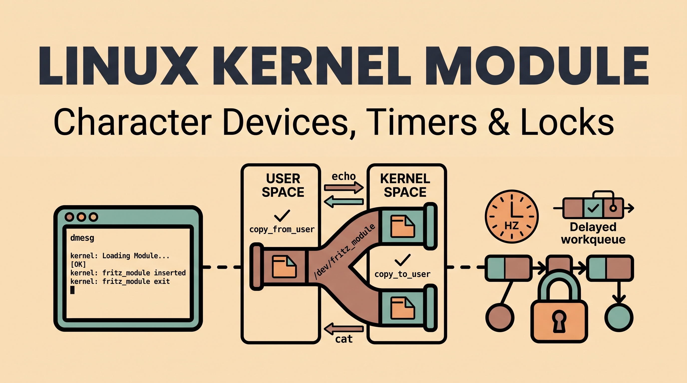

Since I'm working on an Apple Silicon Mac, I had to figure out a good way to run a native ARM Linux environment. I ended up using UTM to spin up an Ubuntu Server 26.04 virtual machine. I went with the minimal installation (no GUI) to keep things fast and lightweight.

During the initial OS setup, I created the default user and pulled my public SSH keys straight from GitHub. This was a great shortcut because it let me SSH into the VM from my Mac terminal immediately without messing with passwords. Once inside the VM, we generated a brand new SSH key pair and added the public key to my GitHub settings so we could push commits back to this repository.

Taking notes is a fantastic idea! Taking a step back to understand the "why" behind the code is exactly how you transition from just copying/pasting to actually thinking like an engineer.

Let's break this down from the absolute beginning so you have a rock-solid understanding of what you just built.

Here are the notes rewritten into natural, flowing paragraphs that sound like you wrote them yourself. You can copy and paste this directly into your notes:

## What is a Linux Kernel Module?

A Linux Kernel Module (LKM) is a piece of compiled code that we can inject directly into that running brain without having to restart the machine. In the old days, if you wanted to add support for a new piece of hardware, you had to modify the base kernel code, recompile the entire massive operating system, and reboot. Modules let us bypass all that and load code dynamically on the fly.

This setup keeps the main kernel super lightweight and efficient. Instead of forcing the kernel to hold the instructions for every single device ever manufactured, it only loads the modules it actually needs for the specific hardware it's running on. It also makes patching things way easier. If there is a bug in something like a Wi-Fi driver, we can just unload that specific module, load in the updated code, and keep the server running without any downtime.

It is a lot like adding an extension to a web browser. You don't have to reinstall your entire browser just to add an ad-blocker; you just install the plugin, it hooks deeply into the browser's core, and you can turn it on or off whenever you want.

### The Makefile

```make
obj-m += hello.o

all:
	make -C /lib/modules/$(shell uname -r)/build M=$(PWD) modules

clean:
	make -C /lib/modules/$(shell uname -r)/build M=$(PWD) clean
```

The `obj-m` part stands for "object module," and appending our file to it tells the kernel that we want to build a loadable kernel module rather than something permanently built into the kernel itself. Even though our source code is in `hello.c`, we tell it to output `hello.o` because that is the intermediate object file the compiler creates right before it generates the final `hello.ko` plugin file.

The `all` block is what runs by default when we type `make` in the terminal. We use `make -C` to temporarily switch directories over to the official Linux headers installed on the system. 

The `-C` flag simply stands for "change directory." When we use `make -C`, we are telling the make command to temporarily leave our current folder, jump into a completely different directory, and use the Makefile it finds over there instead.

In the context of our kernel module, we don't actually know how to compile kernel code ourselves—it requires hundreds of specific flags and settings. By using `make -C /lib/modules/...`, we are telling our terminal to hop over to the official Linux kernel directory and borrow the massive, complex Makefile that the kernel developers already wrote. It basically hands the hard work off to the kernel's own build system, and once it finishes compiling our code, it hops right back to our folder.

By using `$(shell uname -r)`, the command automatically grabs the exact version of the kernel we are currently running, ensuring it builds against the right files.

The `M=$(PWD)` piece tells it to look back at our current working directory to actually find and compile our code into modules. by setting M equal to our current path, we are telling the kernel's build system, "Hey, the external module you need to compile is located back over here in this specific folder." That way, it knows exactly where to look for our hello.c file and where to spit out the finished .ko file when it is done.

By adding the word modules at the very end, we are giving it a precise command. We are saying, "Don't build the whole kernel right now; just build the external loadable modules".

Finally, the `clean` block at the bottom does the exact same directory-switching trick. But instead of telling the kernel to build our module, it tells it to sweep through our folder and delete all the temporary compiled files and `.ko` files it created earlier. This gives us a completely clean slate whenever we type `make clean`.

## The Macros

Including <linux/module.h> just gives us the ability to use those macros. It is basically like importing a blank form; we still have to actually fill it out and tell the kernel what our specific module is doing.
The MODULE_LICENSE("GPL") line is actually strictly required. The Linux kernel is very protective of its open-source status. If we don't explicitly declare that our code is GPL-compatible, the kernel will complain about being "tainted" by potentially proprietary code.

```c

static LIST_HEAD(word_list);
static DEFINE_MUTEX(word_mutex);

struct word_node {
  char *word;
  struct list_head list;
};
```

The kernel’s linked list implementation (via `<linux/list.h>`) is a circular, doubly-linked list, and it relies heavily on pre-defined macros to manage memory safely. The foundation is `LIST_HEAD()`, which statically initializes the main list head by pointing its `next` and `prev` pointers at itself. When we process user input, we dynamically allocate our custom struct and use `list_add_tail()`. This function takes the `list_head` embedded inside our new struct and wires it into the end of the chain, updating the previous tail and the main head pointers automatically.

The most critical macros in this API handle the extraction of data, specifically `list_first_entry()`. Because the Linux kernel embeds the linked list nodes *inside* the data structures rather than wrapping the data inside a node, you can't just dereference a pointer to get your payload. `list_first_entry()` uses the kernel's famous `container_of()` macro under the hood to perform raw pointer arithmetic—it calculates the exact memory offset from the embedded `list_head` back to the start of your custom struct so you can actually read the string. In our workqueue, we combine this with `list_empty()` to ensure we don't cause a null pointer dereference, and `list_del()` to safely sever the pointers before we extract the word and free the memory.

## static struct delayed_work print_work;

This line is basically us declaring the object that will manage our background threading.

**The `static` Keyword**
We already know this from standard C, but the `static` keyword here is just restricting the scope of the variable to this specific file. 

**`struct delayed_work`**
This is a specific data structure provided by `<linux/workqueue.h>`. You can think of it as a specialized task container. The kernel uses workqueues to push non-urgent tasks into the background so they don't block the main system processes. A standard `work_struct` would tell the kernel to run the task immediately, but a `delayed_work` struct includes a built-in timer. It holds the pointer to the function we want to execute and keeps track of the countdown.

We declare it globally at the top of the file because multiple different functions need to talk to it. Our `module_init` function needs to configure it and kick it off for the very first time, and our actual printing function needs to reference it so it can reschedule itself to run again.

## Aufgabe 1: Module Basics

The first step was just getting a basic module to compile, load, and unload safely. I wrote a simple C file using the `module_init` and `module_exit` macros. It uses `printk` to drop a status message into the kernel log (`dmesg`) whenever the module is inserted or removed.

### The Init Function (`my_init`)

The `__init` macro tells the kernel that this function is only used once during the module loading phase. Once the module is loaded, the kernel drops this function from RAM to save memory. Inside, we use `INIT_DELAYED_WORK()` to map the `print_work` struct we declared earlier to the actual `print_word_work` function containing our logic. Then, `misc_register()` tells the kernel to create the character device endpoint in userspace (`/dev/fritz_module`), which allows standard terminal commands like `echo` and `cat` to trigger the module's read and write routines. Finally, `printk` writes our success message to the `dmesg` log.

### The Exit Function (`my_exit`)

The `__exit` macro marks the function responsible for cleaning up right before the module is removed (via `rmmod`). Teardown order is critical here to prevent kernel panics. First, `misc_deregister()` removes the `/dev/fritz_module` file so userspace can no longer interact with it. Next, `cancel_delayed_work_sync()` ensures our background timer is stopped and fully finished executing before we pull the module out of memory. If a delayed workqueue fired *after* the module was unloaded, the kernel would try to execute code that no longer exists, resulting in an immediate system crash.

### Memory Cleanup

After stopping the background task, we must prevent memory leaks by freeing any dynamically allocated memory left in the linked list. We lock the mutex and iterate through the list using `list_for_each_entry_safe()`. We strictly have to use the `_safe` variant of the macro here rather than a standard iterator because we are actively deleting nodes while traversing them. The `_safe` macro uses a temporary pointer (`tmp`) to hold the next node's address before we call `list_del()` and `kfree()` on the current one. This guarantees we don't accidentally follow a freed, invalid pointer into kernel space.

Since kernel space doesn't have a standard output (`stdout`) attached to a terminal like a normal C program, you can't just use `printf()` to output text. If you try, the compiler will throw an error because the kernel has no concept of a terminal screen.

Instead, the kernel has its own internal, fixed-size memory block dedicated exclusively to logging, known as the **ring buffer**.

When we use `printk()` in our module, we are writing our strings directly into that internal ring buffer. The `dmesg` command (short for "diagnostic messages") is simply the userspace tool we run in the terminal to read that memory buffer and dump its contents to the screen. It is essentially our only window into what the kernel—and our module—is actively doing behind the scenes.

## ring buffer

Because the kernel operates in an environment where it absolutely cannot afford to run out of memory or crash, it pre-allocates a fixed chunk of RAM for the log buffer during boot. Once that chunk fills up, the pointer just wraps right back around to the beginning, and the newest messages start silently overwriting the oldest ones.

This design guarantees that the kernel will never accidentally consume all your system RAM just because a buggy driver is spamming the log with millions of errors. It trades long-term history for absolute system stability.

## module_init

`module_init()` and `module_exit()` are special kernel macros that act like registration desks. When you compile the code, they leave a little tag in the final `.ko` file. Later, when you run `sudo insmod hello.ko` in the terminal, the kernel looks for the `module_init` tag, sees that you attached `my_init` to it, and executes that specific function. When you run `sudo rmmod hello`, it looks for the `module_exit` tag and runs your teardown sequence.

Kernel developers universally put them at the absolute bottom of the file by convention.

## Aufgabe 2: Userspace Communication

The parameters in `dev_write` are handed to us directly by the kernel whenever someone tries to write to our device file. We get a pointer to the file itself, the length of the incoming data (`len`), and the current file offset. But the most interesting part is the `const char __user *buffer`. That `__user` tag is basically a giant warning label. It doesn't actually change the compiled code, but it tells the kernel's static analysis tools that this memory address belongs to user space. It serves as a strict reminder to developers that this pointer is completely untrusted and we are absolutely not allowed to dereference it directly without using `copy_from_user` first.

Inside the function, we set up a few char pointers that we will use for our string parsing later, and then immediately hit the `if (len > 1024)` check. This is a basic but critical security mechanism. Kernel memory is precious and, unlike standard user applications, it cannot be swapped out to the hard drive if the system gets low on RAM.

If we didn't cap the size, a user could accidentally (or maliciously) pipe a massive 10GB file directly into our device. Our module would blindly pass that massive length to `kmalloc`, attempt to lock up a massive chunk of physical RAM, and likely trigger an Out-Of-Memory kernel panic that would crash the whole VM. If the user tries to send more than our 1024-byte limit, we just reject it immediately and return `-EINVAL`, which is the standard Linux error code for "Invalid Argument". It safely catches the mistake and kicks the error back up to the terminal.

### strsep

```c
str_ptr = input_buf;
while ((token = strsep(&str_ptr, " \n\t")) != NULL) {
  if (*token == '\0')
    continue;

```

It is actually a standard C function—it was designed as the modern, thread-safe replacement for the old `strtok` function—and the Linux kernel provides its own highly optimized version of it via `<linux/string.h>`.

It is destructive. When we hand `strsep` your string and your list of delimiters (spaces, newlines, and tabs), it scans forward until it hits one of those characters. It physically overwrites that delimiter with a `\0` null terminator, breaking it off from the rest of the string. It then hands us back the `token` pointer pointing to the start of that newly isolated word, and automatically bumps the original `str_ptr` forward so it is ready to find the next word on the next loop iteration.

There is a really important distinction on that `if` statement, though. We aren't actually checking if the `token` pointer itself is `NULL`—the `while` loop's condition already handles that to know when we've reached the end of the entire buffer. Instead, we are checking if the *first character* of the token is a null terminator (`*token == '\0'`).

We have to do this to handle consecutive spaces. If a user accidentally types two spaces in a row between words, `strsep` will overwrite the first space with a `\0` and hand us back an "empty string" of zero length. If we didn't have that `continue` check, we would end up allocating memory and adding blank, invisible nodes to our linked list. That little check just tells the loop to safely skip over consecutive spaces and tabs.

### How `dev_write` gets called automatically

When you run `echo "hello" > /dev/fritz_module`, your terminal is just executing a standard system `write()` call on what it assumes is a normal text file. But earlier in your code (likely near the bottom), you defined a `struct file_operations` block. That block acts like a routing table. It explicitly tells the kernel, "Hey, if any userspace program tries to write data to this specific device file, intercept it and route that data straight into my `dev_write` function."

You handed that routing table to the kernel in your `my_init` function using `misc_register()`. Because of that, the kernel handles the interception and routing entirely automatically for you.

### How `print_work` knows what to do

You are exactly right that `dev_write` doesn't tell the timer *what* function to execute—it only tells it *when* to execute it (in `HZ` ticks, which equals one second).

If we look back at the `my_init` function we reviewed a few messages ago, you have this exact line:
`INIT_DELAYED_WORK(&print_work, print_word_work);`

That macro takes the blank `print_work` struct we declared globally at the top of the file and permanently embeds a pointer to our `print_word_work` function right inside it.

So by the time our `dev_write` function calls `schedule_delayed_work()`, that `print_work` object already knows which function it is supposed to run. `dev_write` is essentially just reaching over and pressing the "start 1-second countdown" button on an already-configured timer.

---

The `my_write` function is what gets triggered the second we run a command like `echo "hello world" > /dev/fritz_module` in the terminal. The biggest hurdle here is that user space (the terminal) and kernel space (our module) are strictly isolated in RAM for security reasons. The kernel cannot simply dereference a pointer from user space.

We first have to allocate a fresh block of memory inside the kernel using `kmalloc()`. We pass it the `GFP_KERNEL` flag, which tells the kernel's memory allocator that it is allowed to put the current process to sleep and wait if the system is currently low on free memory.

Once we have that secure kernel memory block, we use the `copy_from_user()` macro. This is a highly optimized, security-checked function that explicitly copies the payload from the restricted `__user` buffer into our newly allocated kernel memory. If it fails—usually because the user space program handed us an invalid memory address—it returns the number of bytes it failed to copy, allowing us to throw an error and abort gracefully rather than crashing the system.

After the string is safely copied into kernel space, we clean it up by swapping the trailing newline character for a null terminator. Since the assignment required word-by-word printing, we use a `while` loop combined with `strsep()` to chop that single string into individual words based on spaces.

For each word we find, we dynamically allocate a new `word_node` struct. We then lock the `word_mutex` to ensure nothing else is touching the list, use `list_add_tail()` to snap our new word onto the end of the chain, and instantly unlock the mutex. Finally, we call `schedule_delayed_work()` to guarantee our background timer is ticking, telling it to wake up in exactly one second (using the `HZ` macro) to start popping words off the front of the list.

```c
static ssize_t dev_write(struct file *filep, const char __user *buffer,
                            size_t len, loff_t *offset) {
char *input_buf, *str_ptr, *token;

if (len > 1024)
return -EINVAL; 
[...]
}
```

The parameters in `dev_write` are handed to us directly by the kernel whenever someone tries to write to our device file. We get a pointer to the file itself, the length of the incoming data (`len`), and the current file offset. But the most interesting part is the `const char __user *buffer`. That `__user` tag doesn't actually change the compiled code, but it tells the kernel's static analysis tools that this memory address belongs to user space. It serves as a strict reminder to developers that this pointer is completely untrusted and we are absolutely not allowed to dereference it directly without using `copy_from_user` first.

Inside the function, we set up a few char pointers that we will use for our string parsing later, and then immediately hit the `if (len > 1024)` check. This is a basic but critical security mechanism. Kernel memory is precious and, unlike standard user applications, it cannot be swapped out to the hard drive if the system gets low on RAM.

If we didn't cap the size, a user could accidentally (or maliciously) pipe a massive 10GB file directly into our device. Our module would blindly pass that massive length to `kmalloc`, attempt to lock up a massive chunk of physical RAM, and likely trigger an Out-Of-Memory kernel panic that would crash the whole VM. If the user tries to send more than our 1024-byte limit, we just reject it immediately and return `-EINVAL`, which is the standard Linux error code for "Invalid Argument". It safely catches the mistake and kicks the error back up to the terminal.

* I registered a character device that shows up at `/dev/fritz_module`.
* When I `echo` text into it, the module uses `kmalloc` to allocate dynamic memory and stores the input safely using `copy_from_user`.
* When I `cat` the device, it reads that dynamic memory and sends it back to the terminal using `copy_to_user`.

## miscdevice API

```c
static struct miscdevice my_misc_device = {
.minor = MISC_DYNAMIC_MINOR, .name = "fritz_module", .fops = &fops}; 

```

This is a standard example of the Linux kernel's `miscdevice` API, these specific fields are exactly what we will see in almost every basic character device module.

Writing device drivers from scratch used to require manually requesting a "major number" to identify the driver, explicitly creating a device class, and manually generating the `/dev/` file. To save developers from writing all that boilerplate for simple modules, kernel devs created the "misc" (miscellaneous) framework. All misc devices share a single major number (10), meaning we only have to fill out this one small struct to get everything wired up automatically.

The syntax used here (`.minor = ...`) is a standard C99 feature called designated initializers. The kernel uses this everywhere because it lets us initialize specific fields in a massive struct while safely ignoring the ones we don't need.

Here is the breakdown of the three fields:

* **`.minor = MISC_DYNAMIC_MINOR`**: Every device file needs a minor number to distinguish it from other devices sharing the same major number. By passing this macro, we are telling the kernel, "I don't care what number I get, just automatically assign me the next available one so I don't accidentally collide with another device."
* **`.name = "fritz_module"`**: This is exactly what tells the system's device manager (udev) to automatically create the `/dev/fritz_module` file for us when the module loads.
* **`.fops = &fops`**: This is where we attach that routing table we just talked about. We are literally linking our device file to the `file_operations` struct that holds the pointers to our `dev_write` and `dev_read` functions.

Once this struct is built, handing it to `misc_register(&my_misc_device)` inside our init function is all it takes to bring the whole device online.

### printk

The kernel has no concept of a terminal screen, so we can't use standard C library functions like `printf()`. `printk()` (Print Kernel) is the kernel's dedicated logging function. It formats our text and dumps it directly into that internal memory buffer, waiting for us to read it later using the `dmesg` command.

**The Log Level (`KERN_INFO`)**
Because the kernel handles everything from minor USB plug-ins to fatal hardware failures, the log gets incredibly noisy. To manage this, `printk` uses severity levels. `KERN_INFO` is just a tag that tells the logging system, "This is standard operational information, not a warning or an error." If something went horribly wrong in our module, we would use `KERN_ERR` or `KERN_ALERT` instead, which might actually trigger the system to print the message directly to the physical console screen to grab the admin's attention.

If you look closely at the syntax, you'll notice there is no comma between `KERN_INFO` and the `"Hello..."` string.

Under the hood, `KERN_INFO` is just a macro that gets swapped out for a hidden string (usually something like `"<6>"` representing log level 6). In C, if you place two string literals directly next to each other with no punctuation in between, the compiler automatically concatenates them together into one single string before the code ever runs. So by the time `printk` actually executes, it is just receiving one single string argument: `"<6>Hello Kernel: Module loaded successfully.\n"`.

Yes, absolutely every part of the kernel shares this exact same buffer. It is a completely shared, chaotic space.

Whether it is the network driver dropping a Wi-Fi packet, the USB subsystem detecting a new mouse, the memory manager throwing an error, or our little `fritz_module` saying hello—every single piece of kernel code uses the exact same `printk` function, and it all gets dumped into the exact same central ring buffer.

It is surprisingly small. The size isn't a hardcoded absolute; it is chosen by the developers who compiled the kernel using a setting called `CONFIG_LOG_BUF_SHIFT`. On a modern Ubuntu Server VM like yours, it usually defaults to a few Megabytes (often around 2MB to 4MB, depending on the architecture).

A busy system will wrap around and start overwriting old logs very quickly.
If the ring buffer overwrites itself in RAM, you might wonder how we can read kernel logs from last week. This is where user-space daemons come in.

Modern Linux systems run a background service (like `systemd-journald` or `rsyslog`). These services constantly monitor the kernel's ring buffer. The second a new message pops up, the service immediately copies it out of the volatile RAM buffer and writes it safely to your permanent hard drive (usually into files like `/var/log/kern.log` or the systemd journal). So by the time the kernel's tiny RAM buffer wraps around and overwrites your message, a permanent copy is already safe on the disk.

### daemons

The origin of the term "daemon" in computer science is actually a really cool piece of hacker history. It has absolutely nothing to do with horror movies or demonic possession.

The term was coined in the early 1960s by programmers at MIT's Project MAC (the project that essentially invented time-sharing operating systems). They needed a name for processes that just hummed along invisibly in the background, waiting to do helpful chores without a user actively controlling them.

They drew inspiration from two places:

**1. Maxwell's Demon (Physics)**
In 1867, physicist James Clerk Maxwell created a famous thought experiment about thermodynamics. He imagined a microscopic, intelligent being—which he called a "demon"—that stood at a tiny door between two gas chambers, tirelessly opening and closing the door to sort fast and slow molecules. The MIT programmers loved this analogy: a tiny, invisible entity constantly working in the background to keep the system organized.

**2. Greek Mythology**
In ancient Greek mythology, a *daimon* (δαίμων) wasn't evil. It was a helpful guardian spirit or subordinate deity that worked behind the scenes to guide people or maintain the natural order.

So, when the MIT devs created the first background programs to handle automated tasks like spooling printer jobs or managing network connections, they named them "daemons" because they were helpful, invisible spirits keeping the system running.

### file_operations

Here is exactly how the routing table works! You will usually find this struct sitting right above your `my_init` function in the code.

It generally looks exactly like this:

```c
static const struct file_operations fops = {
    .owner = THIS_MODULE,
    .read = dev_read,
    .write = dev_write,
};

```

This is the `struct file_operations` (often just called `fops`). In Linux, the Virtual File System (VFS) provides a massive, standard interface for interacting with files. Because "everything is a file" in Linux, device drivers also have to speak this language.

This struct is literally just a collection of function pointers. It maps standard user-space actions (like reading or writing a file) to the specific C functions we wrote in our module. Here is the breakdown for your notes:

**`.write = dev_write`**
When you run `echo "hello" > /dev/fritz_module` in the terminal, the system executes a standard `write()` system call. The kernel sees that you are writing to our specific device, looks at this `fops` table, finds the function pointer attached to `.write`, and immediately jumps to execute our `dev_write` function, passing the string along with it.

**`.read = dev_read`**
The exact same thing happens in reverse. When you run `cat /dev/fritz_module`, the terminal is issuing a `read()` system call. The kernel checks the table, sees the `.read` pointer, and executes our `dev_read` function to fetch the data.

**`.owner = THIS_MODULE`**
This is a critical safety feature. `THIS_MODULE` is a macro that points to our specific kernel module. By setting this, we tie the `fops` table to our module's reference counter.
Imagine a user starts running a massive `cat` command on your device to read data, and right in the middle of it, you try to run `sudo rmmod fritz_module` to delete the module. If the module disappeared from RAM while the user was still actively reading from it, the system would instantly panic and crash. By setting `.owner`, the kernel tracks who is using the file. If someone is currently interacting with it, the kernel simply blocks the `rmmod` command and says, "Module is in use!"

## read

You just spotted the classic "tutorial cheat" in Linux kernel programming. Your logic is 100% correct, and you have essentially just identified why a lot of beginner kernel code would completely break in the real world.

Here is exactly what is happening, why it works for your assignment, and why it is technically a hack.

### The "Cheat" in Simple Modules

For simple assignments, we generally assume our total output string is tiny—usually less than 1KB. When you run `cat`, the user-space buffer it provides is typically huge (often 32KB or 64KB).

Because our data is guaranteed to fit into `cat`'s buffer on the very first try, we take a shortcut:

1. **First Pass:** `cat` calls `read()`. `*offset` is `0`. We build our tiny string, use `copy_to_user`, update `*offset = length`, and return `length`.
2. **Second Pass:** `cat` received the data, but it needs to know if there is *more*. It loops back and calls `read()` again. Now `*offset` is > 0. Our code immediately returns `0` (EOF). `cat` says "Great, I'm done," and exits.

### You Are Right: It Breaks on Big Data

If our linked list had 50,000 words in it, your exact scenario would happen. `cat` would ask for data, we would fill its buffer, and update the offset. When `cat` came back for chunk number two, our `if (*offset > 0) return 0;` would instantly trigger EOF. We would literally truncate the output and the user would never see the rest of their data.

### How Real Drivers Handle It

In a production driver, you don't just check `> 0`. You check the offset against the *total size of your data*. A robust implementation looks more like this:

```c
// 1. Check if the user has already read everything
if (*offset >= total_data_length)
    return 0; // EOF

// 2. Calculate how much is left vs how much they asked for
size_t bytes_left = total_data_length - *offset;
size_t chunk_size = (len < bytes_left) ? len : bytes_left;

// 3. Copy only that specific chunk, picking up exactly where we left off
copy_to_user(buffer, kernel_buffer + *offset, chunk_size);

// 4. Update the offset for the next loop
*offset += chunk_size;
return chunk_size;

```

For "Aufgabe 3," the `> 0` shortcut is almost certainly what your professor expects because dynamically calculating offsets for a linked list that is constantly changing size in the background is a nightmare. But you are absolutely right to question it!

## Aufgabe 3: Lists, Timers, and Locks

### You just hit on the exact reason this assignment is so brilliant. You are actually looking at two completely different systems running at the same time!

You are 100% correct that the words are supposed to be printed one by one. But they are printed to two different places, depending on what is doing the printing.

Here is how the two systems interact. This is the core logic of "Aufgabe 3":

### 1. The Background Worker (`print_word_work`)

This is the timer you mentioned. While you are busy typing in the terminal, this function is running invisibly in the background. Every second, it wakes up, grabs exactly **one** word off the front of your linked list, prints it to the kernel log using `printk`, and then deletes that node from memory.
Because it uses `printk`, you don't see this happen in your main terminal. You only see it if you open a second terminal and run `dmesg -w` (which watches the kernel log in real-time). You will see the words popping up there one by one, every second.

### 2. The Manual Peek (`dev_read` / `cat`)

The `dev_read` function (the loop with `snprintf` we just looked at) is completely separate from the timer. This function only runs if you manually type `cat /dev/fritz_module` in your terminal.

When you run `cat`, you are essentially asking the kernel, *"Hey, what is left in the queue right now?"*
The `dev_read` function locks the list, quickly stitches together whatever words haven't been deleted by the timer yet, and prints them to your terminal screen.

### How They Interact (The Cool Part)

Imagine you send a 10-word sentence into your module:

1. You run `echo "One two three four..." > /dev/fritz_module`.
2. If you instantly run `cat /dev/fritz_module`, you will see all 10 words.
3. If you wait exactly 3 seconds and run `cat` again, you will only see the last 7 words! The background timer (`print_word_work`) already "ate" the first three words and printed them to `dmesg`.
4. If you wait 10 seconds, `cat` will return nothing, because the background worker finished the whole list.

---

This part required a pretty big refactor. Instead of just holding a single string in memory, I needed to print the stored text to the kernel log word by word, exactly one second apart.

* **Linked List:** I split the incoming text into individual words and stored them as nodes in a standard kernel linked list (`struct list_head`).
* **Workqueue Timer:** I set up a `delayed_work` task using the kernel's `HZ` macro. It wakes up once a second, pops the first word off the list, prints it, frees the memory, and schedules itself to run again.
* **Mutex Lock:** Because the background timer is reading and deleting from the list at the exact same time a user might be echoing new words into it, I wrapped the list operations in a Mutex lock so the kernel doesn't crash from concurrent access.


No, you don't need to recompile!

When you ran `make` yesterday, the compiler created the finished `fritz_module.ko` (Kernel Object) file and saved it to your hard drive. Since your hard drive data persists across reboots, that compiled file is still sitting right there in your project folder.

However, because you restarted the VM, the **system RAM** was cleared. The kernel is completely fresh and has "forgotten" that your module was ever installed.

All you need to do is load the existing `.ko` file back into the kernel's memory:

```bash
# 1. Load the module back into the kernel
sudo insmod fritz_module.ko

# 2. Verify it loaded successfully (you should see it in the list)
lsmod | grep fritz_module

```

*(Minor caveat: The only time you would ever *have* to recompile after a reboot is if your VM automatically installed a Linux kernel update while shutting down. Kernel modules are strictly tied to the specific kernel version they were compiled for. But 99% of the time on a standard reboot, your existing `.ko` file is perfectly fine to reuse).*


Ah, you've just hit one of the most famous traps in Linux terminal history! Almost every developer runs into this exact error at some point.

There are actually two different things going wrong here. Let's fix them both so you can test your module.

### 1. The Wrong Device Name

First, you are trying to write to `/dev/hello`. If you look back at our `miscdevice` struct, we explicitly set `.name = "fritz_module"`. So the kernel actually created your endpoint at `/dev/fritz_module`.

### 2. The `sudo` Redirection Trap

Even if you used the right name, `sudo echo "..." > /dev/fritz_module` will still fail with "Permission denied".

Here is why: the `sudo` command only applies to the `echo` part. The `>` redirection is handled by your shell (Bash) *before* the command even executes. So your normal user account tries to open the root-owned `/dev/fritz_module` file to set up the write stream, gets blocked by the OS, and throws a permission error before `echo` even gets a chance to run.

### How to Fix It

To write to a root-owned file, you need to elevate the actual write process, not just the `echo` command. Here are the two standard ways developers handle this:

**Option A: The `tee` Command (Recommended)**
Use standard `echo`, pipe the output to the `tee` program, and run `tee` as root. (The `> /dev/null` just stops it from duplicating the output on your screen).

```bash
echo "One two three four" | sudo tee /dev/fritz_module > /dev/null

```

**Option B: The Root Shell**
Tell `sudo` to open an entire temporary root shell just to run your combined command string:

```bash
sudo bash -c 'echo "One two three four" > /dev/fritz_module'

```

Try running one of those commands, and your data will successfully cross over into kernel space!

This is where the magic of your background timer becomes completely visible. To really see the two different systems interacting, the best method is to use two terminal windows side-by-side.

Here is the exact step-by-step test procedure:

1. **Open two separate terminal windows:**
Set them up side-by-side on your screen. We will use one to monitor the background kernel space, and the other to interact in user space.


2. **Start the live kernel log monitor:**
In **Terminal 1**, run the following command. The `-w` flag stands for "watch"—it will print the current logs, but instead of exiting, it will hang and stream new logs to your screen the exact millisecond they happen.

```bash
dmesg -w

```


3. **Send a long sentence to the module:**
In **Terminal 2**, inject a nice long string of words so the timer has plenty of work to do.

```bash
echo "Apple Banana Cherry Date Elderberry Fig Grape" | sudo tee /dev/fritz_module > /dev/null

```


4. **Quickly read the data back:**
Immediately after sending the string, stay in **Terminal 2** and run `cat` (with `sudo` since the file is root-owned):

```bash
sudo cat /dev/fritz_module

```

Press the "Up" arrow on your keyboard and hit Enter to run `cat` a few more times in rapid succession!


### What You Will See

In **Terminal 1**, you will see your background worker (`print_word_work`) perfectly executing its timer. Every single second, a new word will pop up on the screen: "Apple", then "Banana", then "Cherry", all printed by `printk`.

In **Terminal 2**, you will see `dev_read` dynamically checking the remaining list. If you run `cat` fast enough, you might see "Cherry Date Elderberry Fig Grape". If you wait two seconds and run it again, you will only see "Elderberry Fig Grape".

Once Terminal 1 prints the final word ("Grape"), running `cat` in Terminal 2 will return absolutely nothing, proving your background worker successfully freed all the memory!

## Links

[Ubuntu server download.](https://ubuntu.com/download/server/arm)  
